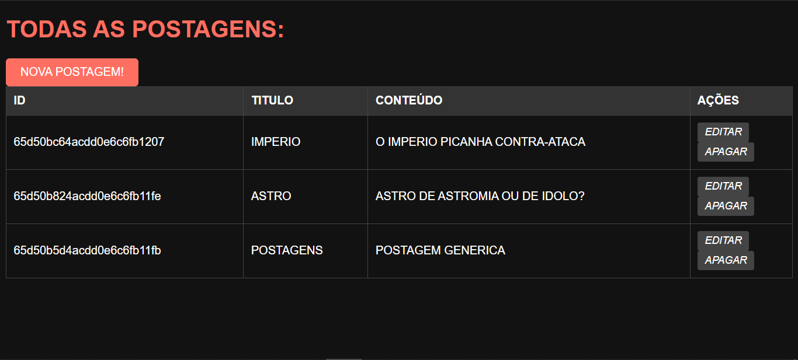
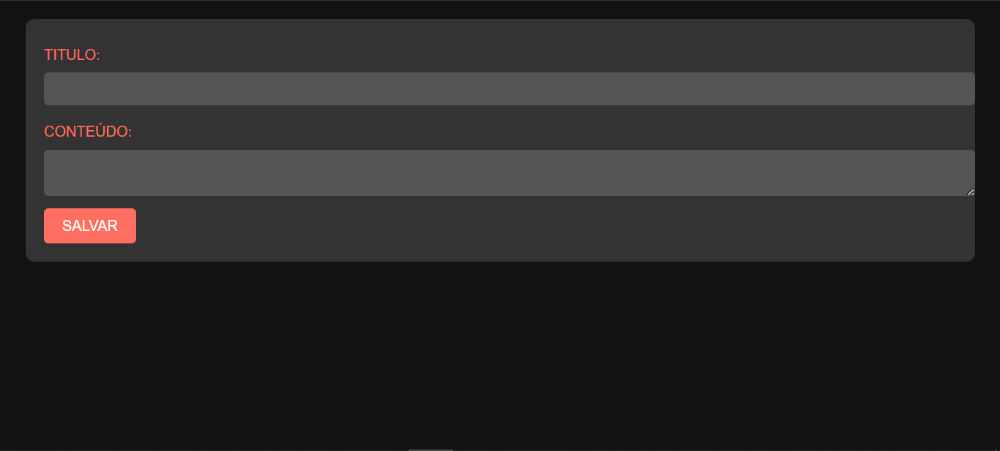
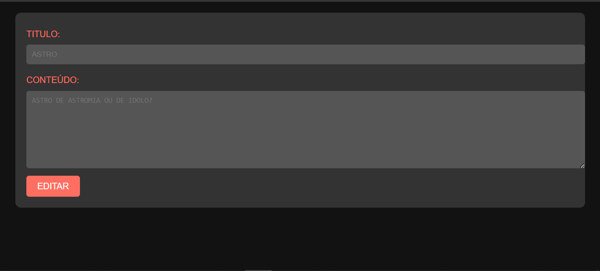
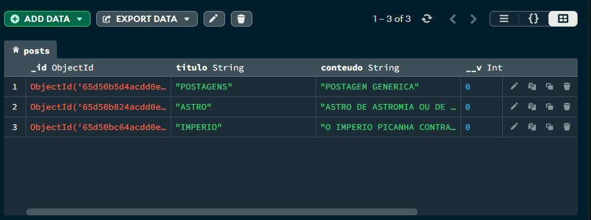

# CRUD DE POSTAGENS COM NODEJS E MONGODB
👨‍🏫APP BÁSICO DE POSTAGENS (CRUD) COMO O INSTAGRAM (SOMENTE TEXTO) COM O NODEJS E MONGODB.

 <br> 
 <br> 
 <br> 
 <br> 

## DESCRIÇÃO:
Este aplicativo é uma plataforma para criar, visualizar, editar e excluir (CRUD) postagens. Aqui está uma descrição mais detalhada das funcionalidades:

1. **Criação de Novas Postagens**: Os usuários podem criar novas postagens preenchendo um formulário com um título e conteúdo e enviando-o. Isso é feito através do formulário "Nova Postagem!" na página principal.

2. **Visualização de Todas as Postagens**: Todas as postagens existentes são exibidas em uma tabela na página principal. Cada postagem é exibida com seu ID, título e conteúdo.

3. **Edição de Postagens**: Os usuários podem editar uma postagem existente clicando no botão de edição associado a cada postagem na tabela. Isso os levará a uma página de edição onde podem modificar o título e o conteúdo da postagem.

4. **Exclusão de Postagens**: Os usuários podem excluir uma postagem existente clicando no botão de exclusão associado a cada postagem na tabela. Isso removerá permanentemente a postagem do banco de dados.

5. **Layout Responsivo e Estilizado**: Estilo escuro e bonito foi adicionado ao código HTML, utilizando uma paleta de cores predominantemente escura, com elementos em destaque em tons de vermelho (#ff6f61). As formas dos elementos foram suavizadas com bordas arredondadas, e os botões apresentam uma aparência de destaque quando são hoverados. O formulário e a tabela foram estilizados para ter uma aparência limpa e moderna, com contraste adequado para facilitar a leitura.

## EXECUTANDO O PROJETO:
1. **Conectando o MONGODB:**
   - Antes de você executar esse APP, você precisa conectar o MONGODB. Para deixar o MongoDB ligado e executando, você pode seguir estas instruções:

   1. **Iniciar o Servidor MongoDB:**
      - No prompt de comando (Windows) ou no terminal (macOS/Linux), execute o seguinte comando para iniciar o servidor MongoDB:
      ```
      mongod
      ```
      - Se o MongoDB estiver instalado corretamente e as variáveis de ambiente estiverem configuradas, o servidor será iniciado e estará pronto para aceitar conexões.

   2. **Verificar se o MongoDB está em execução:**
      - Após iniciar o servidor, você pode verificar se o MongoDB está em execução abrindo outro prompt de comando/terminal e executando o seguinte comando:
      ```
      mongo
      ```
      - Isso abrirá o shell do MongoDB, que estará conectado ao servidor local por padrão. Se você ver uma mensagem indicando que está conectado ao servidor, então ele está em execução.

   3. **Manter o Terminal Aberto:**
      - Para manter o MongoDB em execução enquanto você estiver usando sua aplicação Python, é importante manter o terminal aberto onde você iniciou o servidor MongoDB.

2. **Configuração do `APP.js`:** 
   - Certifique-se de ter um servidor MongoDB em execução localmente na porta padrão (27017), ou ajuste a URL de conexão de acordo com sua configuração.

3. **Instalando as Depêndencias:**
   - Para instalar as dependências listadas no arquivo "package.json", você pode usar o comando `npm install` ou simplesmente `npm i` no terminal. Certifique-se de estar no diretório do seu projeto onde o arquivo "package.json" está localizado. O npm irá ler o arquivo "package.json" e instalar todas as dependências listadas nele. 

   - Aqui está o comando:

   ```bash
   npm install
   ```

   ou

   ```bash
   npm i
   ```

   - Ou se você prefirir, apenas execute esse comando:
   ```bash
   npm install express
   ```

4. **Executando o Aplicativo:**
   - Para subir o servidor, no diretório do seu [projeto](./CODIGO/APP.js), digite o seguinte comando no Terminal/CMD:
   ```bash
   node APP.js
   ```
   - OU:
   ```bash
   nodemon APP.js
   ```

   - Acesse o APP no navegador visitando `http://localhost:8081`.

## NÃO SABE?
- Entendemos que para manipular arquivos em `HTML`, `CSS` e outras linguagens relacionadas, é necessário possuir conhecimento nessas áreas. Para auxiliar nesse aprendizado, oferecemos cursos gratuitos disponíveis:
* [CURSO DE HTML E CSS](https://github.com/VILHALVA/CURSO-DE-HTML-E-CSS)
* [CURSO DE NODEJS](https://github.com/VILHALVA/CURSO-DE-NODEJS)
* [CURSO DE MONGODB](https://github.com/VILHALVA/CURSO-DE-MONGODB)
* [CONFIRA MAIS CURSOS](https://github.com/VILHALVA?tab=repositories&q=+topic:CURSO)

## CREDITOS:
- [PROJETO CRIADO PARA O CURSO DE NODEJS](https://github.com/VILHALVA/CURSO-DE-NODEJS)
- [PROJETO EDITADO PELO VILHALVA](https://github.com/VILHALVA)


